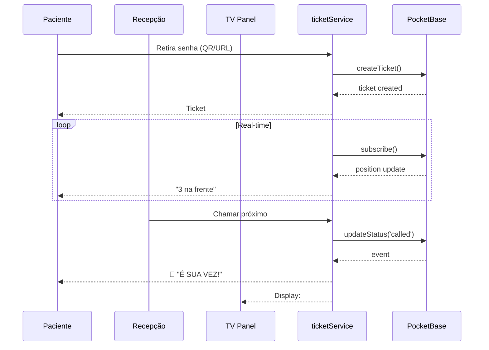

<div align="center">


# FilaZero Saúde

### 🏥 Sistema de Gestão de Filas para Saúde | Healthcare Queue Management

[](https://github.com/glferreira-devsecops/filazero/actions)
[](https://filazero.vercel.app)
[](./LICENSE)
[](./CHANGELOG.md)

**Transforme a experiência do paciente. Elimine filas físicas. Aumente a eficiência.**

[🚀 Demo](https://filazero.vercel.app/clinic/demo) •
[📖 Docs](#-documentação) •
[⚡ Quick Start](#-quick-start) •
[🏗️ Arquitetura](#-arquitetura)

---

</div>

## 📋 Índice

- [Sobre](#-sobre)
- [Features](#-features)
- [Tech Stack](#-tech-stack)
- [Quick Start](#-quick-start)
- [Arquitetura](#-arquitetura)
- [Estrutura do Projeto](#-estrutura-do-projeto)
- [API Reference](#-api-reference)
- [Deploy](#-deploy)
- [Roadmap](#-roadmap)
- [Contribuição](#-contribuição)

---

## 🎯 Sobre

**FilaZero Saúde** é uma plataforma SaaS B2B que revoluciona a gestão de filas em clínicas e hospitais. Através de uma abordagem 100% digital, eliminamos o caos das salas de espera e oferecemos uma experiência premium para pacientes e profissionais de saúde.

### 🔑 Problema que Resolvemos

| Antes | Depois |
|-------|--------|
| ❌ Salas de espera lotadas | ✅ Pacientes aguardam remotamente |
| ❌ Tempo de espera indefinido | ✅ Estimativa em tempo real |
| ❌ Chamadas manuais por nome | ✅ Notificações automáticas |
| ❌ Sem métricas de atendimento | ✅ Dashboard com analytics |
| ❌ Risco de contágio | ✅ Distanciamento garantido |

### 📊 Resultados Comprovados

<div align="center">

| Métrica | Resultado |
|---------|-----------|
| ⏱️ Redução tempo de espera | **-45min** |
| 📈 Aumento produtividade | **+32%** |
| 😊 Satisfação (NPS) | **78 pts** |
| 💰 ROI médio | **30 dias** |

</div>

---

## ✨ Features

### 📱 Experiência do Paciente

- **Senha Digital Instantânea** - QR Code ou URL, sem baixar app
- **Tracking em Tempo Real** - Posição na fila atualizada a cada segundo
- **Estimativa Inteligente** - Tempo de espera calculado dinamicamente
- **Notificações** - Alerta sonoro, vibração e voz quando for sua vez
- **Aguarde de Qualquer Lugar** - Casa, carro, cafeteria

### 🖥️ Painel da Recepção

- **Dashboard Operacional** - Visão completa da fila
- **Chamada em 1 Clique** - Workflow otimizado
- **Busca por Nome** - Encontre pacientes instantaneamente
- **Priorização** - Normal, Prioridade, Urgência
- **Pausar/Retomar** - Quando paciente sai temporariamente
- **Histórico do Dia** - Atendimentos e no-shows

### 📺 Painel TV (Sala de Espera)

- **Display Profissional** - Otimizado para TVs
- **Chamada por Voz** - Síntese de voz em português
- **Últimos Chamados** - Histórico visual
- **QR Code Integrado** - Para novos pacientes
- **Modo Fullscreen** - Imersivo e elegante

### 📊 Relatórios & Analytics

- **KPIs em Tempo Real** - Total, espera, eficiência
- **Distribuição por Hora** - Gráfico visual
- **Horários de Pico** - Top 3 identificados
- **Exportação CSV** - Para análise externa
- **Filtros Flexíveis** - Hoje, semana, mês

### ⚙️ Configurações Avançadas

- **Informações da Clínica** - Nome, endereço, telefone
- **Horário de Funcionamento** - Abertura, fechamento, almoço
- **Notificações** - Som, voz, push notifications
- **Fila** - Timeout, auto-chamar próximo
- **Segurança** - Exigir nome, senhas anônimas, Rate Limiting
- **Impressão** - Geração de tickets físicos com data/hora e QR Code

### ♿ Acessibilidade (a11y)

- **Skip Links** - Navegação por teclado otimizada
- **ARIA Labels** - Suporte a leitores de tela
- **Contraste** - Cores verificadas para legibilidade
- **Responsivo** - Funciona em qualquer zoom

---

## 🛠 Tech Stack

<div align="center">

| Categoria | Tecnologia |
|-----------|------------|
| **Frontend** |   |
| **Styling** |   |
| **Backend** |  |
| **Realtime** |  |
| **PWA** |  |
| **Deploy** |   |
| **Icons** |  |

</div>

### Decisões Arquiteturais

- **React 18** - Concurrent rendering, Suspense boundaries
- **Vite** - Build ultra-rápido, HMR instantâneo
- **PocketBase** - Backend em Go, SQLite WAL mode, sub-10ms latency
- **Context API** - State management leve, sem Redux overhead
- **CSS Variables** - Design system consistente
- **Service Worker** - PWA com offline support

---

## 🚀 Quick Start

### Pré-requisitos

- Node.js 18+
- npm ou yarn
- PocketBase (opcional para produção)

### Instalação

```bash
# 1. Clone o repositório
git clone https://github.com/glferreira-devsecops/filazero.git
cd filazero

# 2. Instale dependências
cd frontend && npm install

# 3. Configure variáveis de ambiente (opcional)
cp .env.example .env

# 4. Inicie o servidor de desenvolvimento
npm run dev
```

### Demo Mode

O sistema detecta automaticamente se está em ambiente de desenvolvimento ou Vercel e ativa o **Demo Mode** com dados mockados. Ideal para testes e demonstrações.

```bash
# Acesse a demo
http://localhost:5173/clinic/demo
```

---

## 🏗 Arquitetura

```
┌─────────────────────────────────────────────────────────────┐
│                        FRONTEND                              │
│  ┌─────────────┐ ┌─────────────┐ ┌─────────────┐            │
│  │   Patient   │ │  Reception  │ │   TV Panel  │            │
│  │   Mobile    │ │  Dashboard  │ │   Display   │            │
│  └──────┬──────┘ └──────┬──────┘ └──────┬──────┘            │
│         │               │               │                    │
│         └───────────────┼───────────────┘                    │
│                         │                                    │
│              ┌──────────▼──────────┐                         │
│              │    ticketService    │  ← Mock/Real adapter    │
│              └──────────┬──────────┘                         │
└─────────────────────────┼───────────────────────────────────┘
                          │
              ┌───────────▼───────────┐
              │      PocketBase       │
              │  ┌─────────────────┐  │
              │  │ SQLite (WAL)    │  │
              │  │ Real-time SSE   │  │
              │  │ Auth System     │  │
              │  └─────────────────┘  │
              └───────────────────────┘
```

### Fluxo de Dados



---

## 📁 Estrutura do Projeto

```
filazero-saude/
├── frontend/
│   ├── public/
│   │   ├── manifest.json      # PWA manifest
│   │   └── sw.js              # Service Worker
│   ├── src/
│   │   ├── components/        # Componentes reutilizáveis
│   │   │   ├── DemoModeBadge.jsx
│   │   │   ├── ErrorBoundary.jsx
│   │   │   └── RequireAuth.jsx
│   │   ├── context/           # React Context providers
│   │   │   ├── AuthContext.jsx
│   │   │   └── ToastContext.jsx
│   │   ├── pages/             # Páginas da aplicação
│   │   │   ├── Dashboard.jsx  # Admin dashboard
│   │   │   ├── Landing.jsx    # Homepage
│   │   │   ├── Login.jsx      # Autenticação
│   │   │   ├── NotFound.jsx   # 404
│   │   │   ├── Reception.jsx  # Painel recepção
│   │   │   ├── Reports.jsx    # Analytics
│   │   │   ├── RoomPanel.jsx  # Painel TV
│   │   │   ├── Settings.jsx   # Configurações
│   │   │   └── TicketStatus.jsx # Status paciente
│   │   ├── services/
│   │   │   ├── pocketbase.js  # PocketBase client
│   │   │   └── ticketService.js # Business logic
│   │   └── utils/
│   │       ├── demoUtils.js   # Mock data generation
│   │       └── security.js    # Sanitization, rate limiting
│   └── index.html
├── backend/                   # PocketBase (Go)
├── docs/                      # Documentação completa
│   ├── en/                    # English docs
│   └── pt-br/                 # Portuguese docs
├── vercel.json                # Deploy config
└── README.md
```

---

## 🔌 API Reference

### ticketService.js

| Função | Descrição | Parâmetros |
|--------|-----------|------------|
| `createTicket` | Cria nova senha | `clinicId, patientName?, priority?` |
| `subscribeToTicket` | Subscribe para updates de 1 ticket | `clinicId, ticketId, callback` |
| `subscribeToQueue` | Subscribe para toda a fila | `clinicId, callback` |
| `updateTicketStatus` | Atualiza status | `clinicId, ticketId, status` |
| `updateTicketPriority` | Atualiza prioridade | `clinicId, ticketId, priority` |
| `pauseTicket` | Pausa ticket | `clinicId, ticketId` |
| `resumeTicket` | Retoma ticket pausado | `clinicId, ticketId` |
| `searchTicketByName` | Busca por nome | `clinicId, searchTerm` |
| `removeTicket` | Remove da fila | `clinicId, ticketId` |

### Status do Ticket

```javascript
const STATUS = {
  'waiting'    // Na fila
  'called'     // Chamado
  'in_service' // Em atendimento
  'paused'     // Pausado
  'done'       // Finalizado
  'no_show'    // Não compareceu
}
```

### Priority

```javascript
const PRIORITY = {
  'normal'     // Ordem de chegada
  'priority'   // Idosos, gestantes
  'emergency'  // Urgência médica
}
```

---

## 🚀 Deploy

### Vercel (Recomendado)

[](https://vercel.com/new/clone?repository-url=https://github.com/glferreira-devsecops/filazero)

```bash
# Via CLI
vercel --prod
```

### Docker

```dockerfile
# Build
docker build -t filazero .

# Run
docker run -p 3000:3000 filazero
```

### VPS Manual

```bash
# Build de produção
npm run build

# Servir com nginx/caddy
```

---

## 🗺 Roadmap

### v1.1 (Q1 2025)

- [ ] Push Notifications reais
- [ ] Integração com WhatsApp
- [ ] Multi-idiomas (EN/ES)
- [ ] Tema claro

### v1.2 (Q2 2025)

- [ ] Agendamento prévio
- [ ] Múltiplos guichês
- [ ] Fila virtual por especialidade
- [ ] App nativo (React Native)

### v2.0 (2025)

- [ ] Multi-tenant SaaS
- [ ] Billing system
- [ ] Admin super panel
- [ ] White-label

---

## 🤝 Contribuição

1. Fork o projeto
2. Crie sua branch (`git checkout -b feature/AmazingFeature`)
3. Commit suas mudanças (`git commit -m 'Add: AmazingFeature'`)
4. Push para a branch (`git push origin feature/AmazingFeature`)
5. Abra um Pull Request

---

## 📄 Licença

Este projeto é **proprietário**. Para uso comercial ou licenciamento, entre em contato.

---

<div align="center">

### 👨‍💻 Desenvolvido por

**Gabriel Lima Ferreira**

[](https://www.linkedin.com/in/devferreirag/)
[](https://github.com/glferreira-devsecops)
[](mailto:contato.ferreirag@outlook.com)

---

⭐ **Se este projeto te ajudou, deixe uma estrela!** ⭐

</div>
